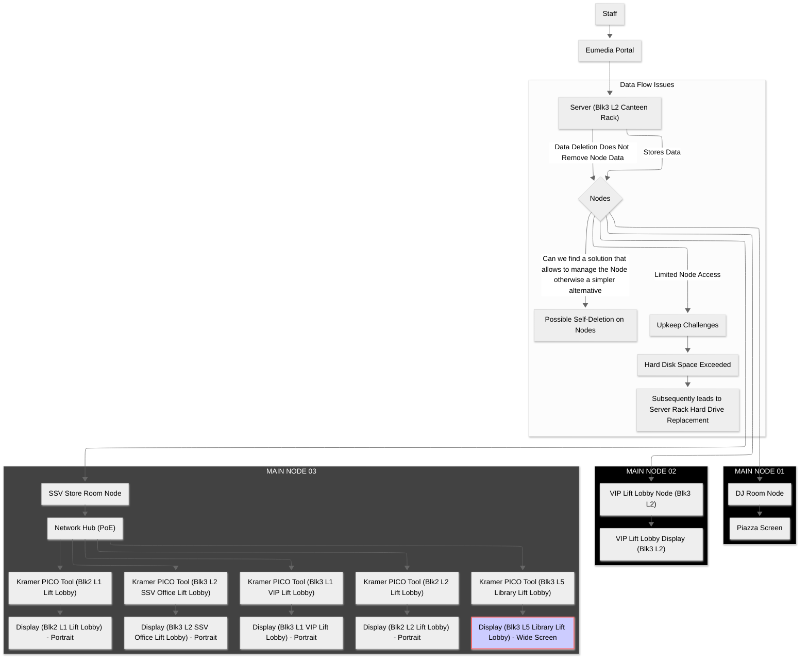

```mermaid

---
config:
  theme: neutral
  look: neo
  layout: elk
---
flowchart TD
 subgraph subGraph0["Data Flow Issues"]
        D{"Nodes"}
        C["Server (Blk3 L2 Canteen Rack)"]
        U["Upkeep Challenges"]
        V["Hard Disk Space Exceeded"]
        W["Subsequently leads to Server Rack Hard Drive Replacement"]
        X["Possible Self-Deletion on Nodes"]
  end
 subgraph s1["MAIN NODE 01"]
        E["DJ Room Node"]
        H["Piazza Screen"]
  end
 subgraph s2["MAIN NODE 02"]
        F["VIP Lift Lobby Node (Blk3 L2)"]
        I["VIP Lift Lobby Display (Blk3 L2)"]
  end
 subgraph s3["MAIN NODE 03"]
        G["SSV Store Room Node"]
        J["Network Hub (PoE)"]
        K["Kramer PICO Tool (Blk3 L2 SSV Office Lift Lobby)"]
        P["Display (Blk3 L2 SSV Office Lift Lobby) - Portrait"]
        L["Kramer PICO Tool (Blk3 L1 VIP Lift Lobby)"]
        Q["Display (Blk3 L1 VIP Lift Lobby) - Portrait"]
        M["Kramer PICO Tool (Blk2 L1 Lift Lobby)"]
        R["Display (Blk2 L1 Lift Lobby) - Portrait"]
        N["Kramer PICO Tool (Blk2 L2 Lift Lobby)"]
        S["Display (Blk2 L2 Lift Lobby) - Portrait"]
        O["Kramer PICO Tool (Blk3 L5 Library Lift Lobby)"]
        T["Display (Blk3 L5 Library Lift Lobby) - Wide Screen"]
  end
    A["Staff"] --> B["Eumedia Portal"]
    B --> C
    C -- Stores Data --> D
    D --> E & F & G
    E --> H
    F --> I
    G --> J
    J --> K & L & M & N & O
    K --> P
    L --> Q
    M --> R
    N --> S
    O --> T
    C -- Data Deletion Does Not Remove Node Data --> D
    D -- Limited Node Access --> U
    U --> V
    V --> W
    D -- Can we find a solution that allows to manage the Node otherwise a simpler alternative --> X
    style T fill:#ccf,stroke:#f66,stroke-width:2px,color:#000000
    style s3 fill:#424242,color:#FFFFFF
    style s2 fill:#000000,color:#FFFFFF
    style s1 fill:#000000,color:#FFFFFF
    style subGraph0 color:#000000

```
